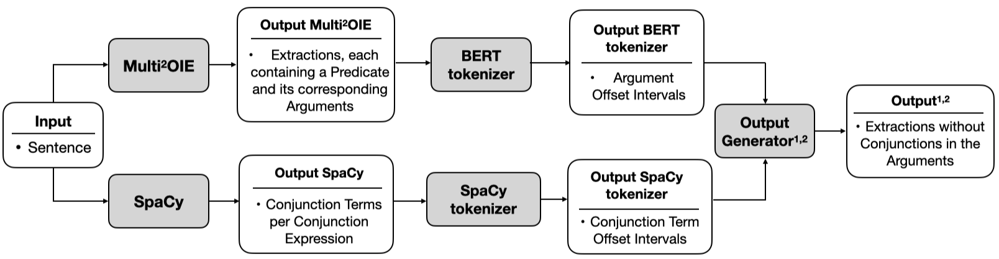
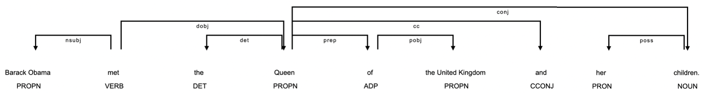
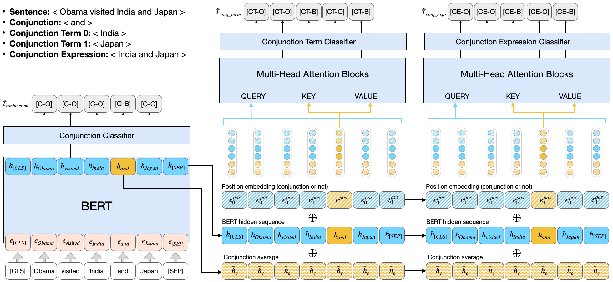

# Enhancing Neural Open Information Extraction for Sentences with Conjunctions

> Source code of Bachelor Thesis

## Baseline 

### Paper 

[**Multi^2OIE: <u>Multi</u>lingual Open Information Extraction Based on <u>Multi</u>-Head Attention with BERT**](https://arxiv.org/abs/2009.08128)<br>

[Youngbin Ro](https://github.com/youngbin-ro), [Yukyung Lee](https://github.com/yukyunglee), and [Pilsung Kang](https://github.com/pilsung-kang)*<br>

### Repository

https://github.com/youngbin-ro/Multi2OIE

### Multi^2OIE Approach


- Step 1: Extract predicates (relations) from the input sentence using BERT
 
- Step 2: Extract arguments using multi-head attention blocks

## Method1

>Method1 implements a dependency parser to improve the extractions of Multi^2OIE by resolving conjunctions in the arguments.

### Overview



### Method1_ct

> Method1_ct is the version of Method1 that replaces a conjunction expression in an argument with each conjunction term belonging to the conjunction expression.



- old argument: the Queen of the United Kingdom and her children
- new argument 1: Queen
- new argument 2: children

### Method1_ct_sup

> Method_ct_sup builds up on Method1_ct by additionally searching for conjunction term token supplements to make the new extraction arguments more informative.


- old argument: the Queen of the United Kingdom and her children
- new argument 1: the Queen of the United Kingdom 
- new argument 2: her children

### Method2

Method2 aims to change the internal architecture of the neural OIE model Multi^2OIE so that the new model can find conjunctions, conjunction terms, and conjunction expressions with the help of three additional classifiers.



- Step 1: Extract predicates (relations) from the input sentence using BERT
 
- Step 2: Extract arguments using multi-head attention blocks

- Step 3: Extract conjunction from the input sentence using BERT 

- Step 4: Extract conjunction terms using multi-head attention blocks

- Step 5: Extract conjunction expressions using multi-head attention blocks

# Usage
## Prerequisites
- python@3.7.13
- poetry

## Environmental Setup

### Install
- in Repository run: ```poetry install```

### Expose Kernel for Jupyter Notebook
- go into the poetry environment with ```poetry shell```
- execute in poetry shell: ```python3 -m ipykernel install --user --name=oie_ani```

### Install Spacy Pipeline
- go into the poetry environment with ```poetry shell```
- execute in poetry shell: ```python3 -m spacy download en_core_web_trf```

### Datasets

#### Dataset Released
- `openie4_train_with_conj.pkl`: https://drive.google.com/file/d/1DpfeqJ8D7hmS4-GulTmaSsICMI_GPat2/view?usp=sharing

#### Do-it-yourself
Original data file (bootstrapped sample from OpenIE4; used in SpanOIE) can be downloaded from [here](https://drive.google.com/file/d/1AEfwbh3BQnsv2VM977cS4tEoldrayKB6/view). Following download, put the downloaded data in './datasets' and use ```create_structured_data_with_conj.py``` and ```preprocess.py``` to convert the data into the format suitable for conjunction training.

To skip the generation of the conjunction dataset a ```structured_data_with_conj.json``` can be downloaded from [here](https://drive.google.com/file/d/1BhDiTmCY4BcBF3zPj_JY-AkMR4opNfD8/view?usp=sharing).

Generate conjunction dataset:
~~~~
cd scripts
python create_structured_data_with_conj.py
~~~~
Preprocess:
~~~~
cd utils
python preprocess.py \
    --mode 'train' \
    --data '../datasets/structured_data_with_conj.json' \
    --save_path '../datasets/openie4_train_with_conj.pkl' \
    --bert_config 'bert-base-cased' \
    --max_len 64
~~~~

### Run the Code

#### Model Released
- Baseline Model: https://drive.google.com/file/d/1UvnVQIF9ZII7ErcYMeicfdz4_EaXlSsb/view?usp=sharing
- Method2 Model: https://drive.google.com/file/d/1wuEEuH4YO_O1oBtuXP_FTzPHlWOHwyAO/view?usp=sharing

The training was done using the Quadro RTX 6000 GPU. The use of other GPU can make the final performance different.

##### for training,

~~~~
python main.py \
    --conj_mode True \
    --trn_data_path './datasets/openie4_train_with_conj.pkl' \
    --save_path './results/conj_with_score'
~~~~

##### for evaluating

~~~~
cd scripts
python evaluate_models.py \
    --baseline_model_path '../results/original/[name_of_baseline_model].bin' \
    --conj_model_path '../results/conj_with_score/[name_of_conjunction_model].bin' \
    --save_path '../results/evaluation'
~~~~

# Expexted Results 

## Baseline 

#### CaRB 
- P: 0.62
- R: 0.44
- F1: 0.52
- AUC: 0.31

#### BenchIE
- P: 0.29
- R: 0.14
- F1: 0.18

#### Customised Dataset
- P: 0.05
- R: 0.01
- F1: 0.02

#### Customised Dataset1
- P: 0.05
- R: 0.02
- F1: 0.03

#### Customised Dataset2
- P: 0.05
- R: 0.01
- F1: 0.02

## Method1_ct

##### CaRB
- P: 0.55
- R: 0.43
- F1: 0.48
- AUC: 0.27

##### BenchIE
- P: 0.25
- R: 0.16
- F1: 0.20

##### Customised Dataset
- P: 0.19
- R: 0.11
- F1: 0.14

##### Customised Dataset1
- P: 0.18
- R: 0.19
- F1: 0.19

##### Customised Dataset2
- P: 0.22
- R: 0.16
- F1: 0.19

## Method1_ct_sup

##### CaRB
- P: 0.56
- R: 0.44
- F1: 0.49
- AUC: 0.27

##### BenchIE
- P: 0.27
- R: 0.17
- F1: 0.21

##### Customised Dataset
- P: 0.24
- R: 0.14
- F1: 0.17

##### Customised Dataset1
- P: 0.23
- R: 0.23
- F1: 0.23

##### Customised Dataset2
- P: 0.32
- R: 0.23
- F1: 0.27

## Method2

#### CaRB
- P: 0.55
- R: 0.43
- F1: 0.48
- AUC: 0.23

#### BenchIE
- P: 0.24
- R: 0.16
- F1: 0.19

#### Customised Dataset
- P: 0.28
- R: 0.15
- F1: 0.19

#### Customised Dataset1
- P: 0.27
- R: 0.26
- F1: 0.26

#### Customised Dataset2
- P: 0.39
- R: 0.28
- F1: 0.32